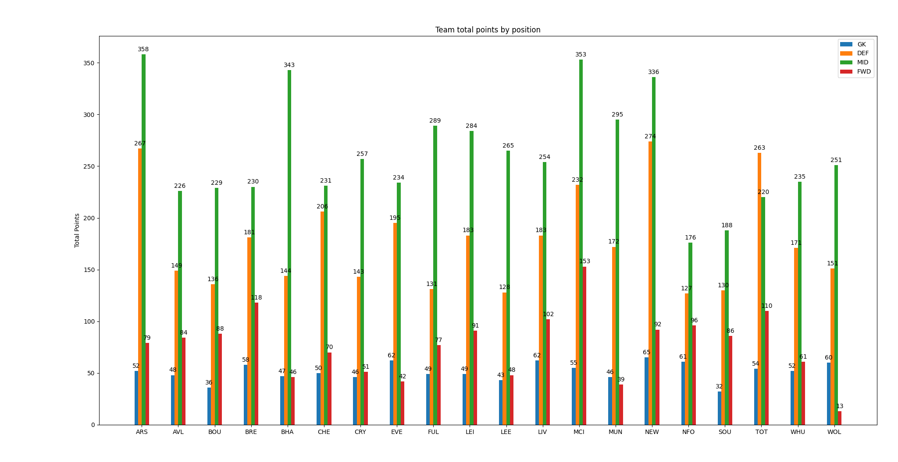

# FPL-Player

## What is it?
API wrapper for Fantasy Premier League Football (FPL) in Python.

Get information about teams, players, fixtures, and gameweeks in package `fpld`.

To come: Predictor for FPL points.

I do not own any of the data. It is available at "https://fantasy.premierleague.com/api/".

## Requirements
* Requires Python 3.10 (Tested on 3.10.4)
* Only tested on Windows

## Installation
Run these two commands:
1. `git clone https://github.com/joew5887/FPL-Player.git`
2. `python setup.py install`

## Example
```
# Graph to show points of every team for each position in a bar graph
import fpld
import matplotlib.pyplot as plt
import numpy as np

teams = fpld.Team.get_all()

gk_points = [sum([p.total_points for p in team.players_by_pos(fpld.Position.get_by_name("GKP"))]) for team in teams]
def_points = [sum([p.total_points for p in team.players_by_pos(
    fpld.Position.get_by_name("DEF"))]) for team in teams]
mid_points = [sum([p.total_points for p in team.players_by_pos(
    fpld.Position.get_by_name("MID"))]) for team in teams]
fwd_points = [sum([p.total_points for p in team.players_by_pos(
    fpld.Position.get_by_name("FWD"))]) for team in teams]

labels = [team.short_name for team in teams]
labels_x = np.arange(len(labels))

fig, ax = plt.subplots()
WIDTH = 0.1

rects1 = ax.bar(labels_x - (3 / 2) * WIDTH, gk_points, WIDTH, label="GKP")
rects2 = ax.bar(labels_x - (1 / 2) * WIDTH, def_points, WIDTH,label="DEF")
rects3 = ax.bar(labels_x + (1 / 2) * WIDTH, mid_points, WIDTH,label="MID")
rects4 = ax.bar(labels_x + (3 / 2) * WIDTH, fwd_points, WIDTH,label="FWD")

# Add some text for labels, title and custom x-axis tick labels
ax.set_ylabel("Total Points")
ax.set_title("Team total points by position")
ax.set_xticks(labels_x, labels)
ax.legend()

ax.bar_label(rects1, padding=3)
ax.bar_label(rects2, padding=3)
ax.bar_label(rects3, padding=3)
ax.bar_label(rects4, padding=3)

fig.tight_layout()

plt.show()
```

Outputs



This is as of 10/12/2022 at 13:52.